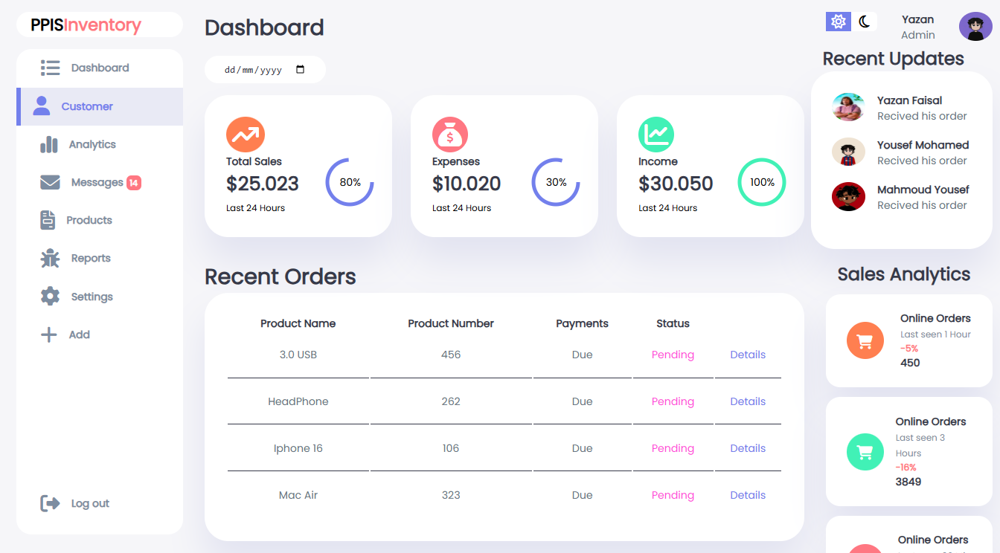

# Dashboard Project




## 📌 Overview
This is a dynamic and interactive dashboard designed to visualize and analyze data effectively. The project is built using modern web technologies to ensure a smooth and responsive user experience.

## ✨ Features
- **Interactive Charts** 📊: Displays real-time data insights.
- **User Authentication** 🔐: Secure login and access control.
- **Customizable Widgets** ⚙️: Personalize your dashboard layout.
- **Responsive Design** 📱: Works on all screen sizes.
- **Dark Mode Support** 🌙: Switch between light and dark themes.

## 📸 Screenshots
(Add your images in the appropriate sections)

### 🔷 Dashboard Home


### 🔷 Charts & Graphs


### 🔷 Settings Page


## 🛠️ Technologies Used
- **Frontend:** HTML, CSS, JavaScript (React/Vue/Angular)
- **Backend:** Node.js / Django / Flask (Specify the one you used)
- **Database:** MySQL / PostgreSQL / Firebase
- **Libraries:** Chart.js, Bootstrap, TailwindCSS, etc.

## 🚀 Installation & Setup
1. Clone the repository:
   ```bash
   git clone https://github.com/YazanFAlagan/Dashboard.git
   ```
2. Navigate to the project directory:
   ```bash
   cd Dashboard
   ```
3. Install dependencies:
   ```bash
   npm install  # or yarn install
   ```
4. Start the development server:
   ```bash
   npm start  # or yarn start
   ```
5. Open your browser and visit `http://localhost:3000`

## 📝 Usage
- Login using your credentials.
- Navigate through different sections.
- Customize widgets and settings.
- View analytics and data insights.

## 📢 Contributing
Feel free to fork this repository and submit pull requests for improvements or bug fixes. Contributions are always welcome!

## 📄 License
This project is licensed under the [MIT License](LICENSE).

## 📧 Contact
For any inquiries or suggestions, reach out to me:
- **Email:** your-email@example.com
- **LinkedIn:** [Your Profile](https://linkedin.com/in/yourprofile)
- **GitHub:** [YazanFAlagan](https://github.com/YazanFAlagan)
