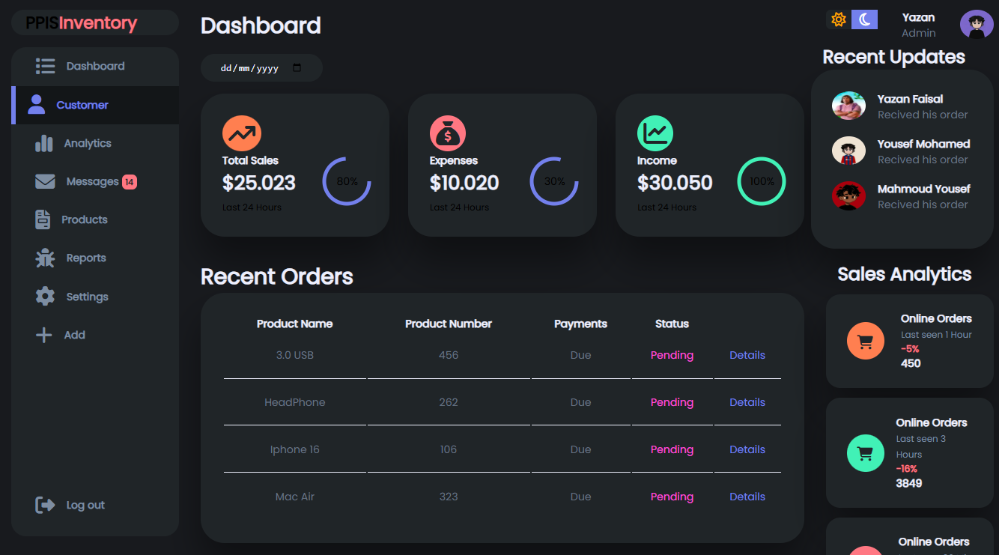
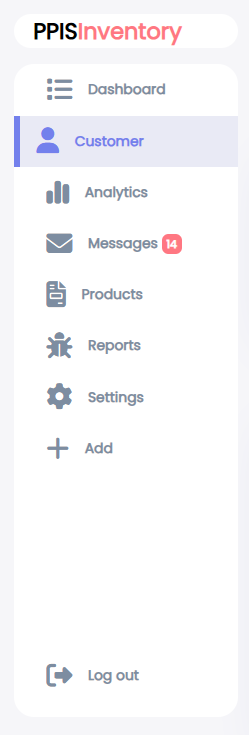
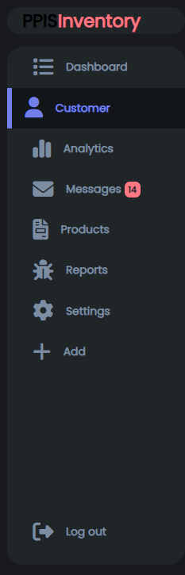
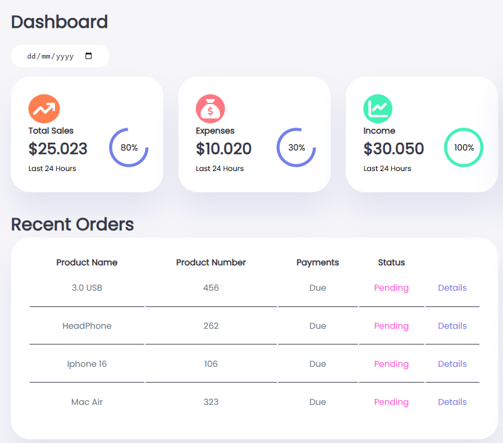
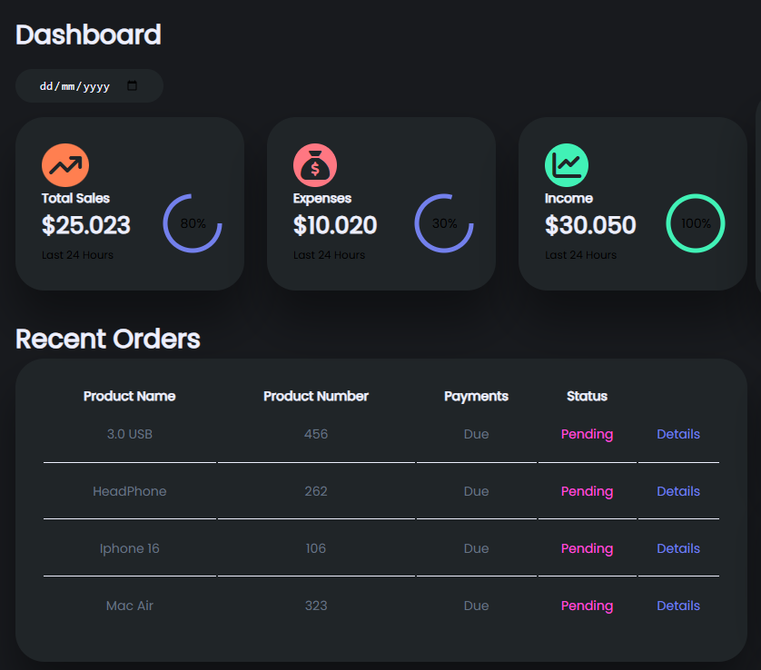
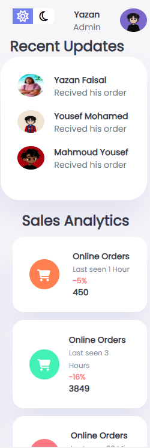
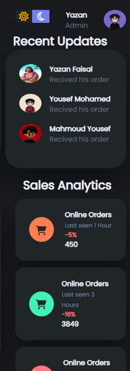
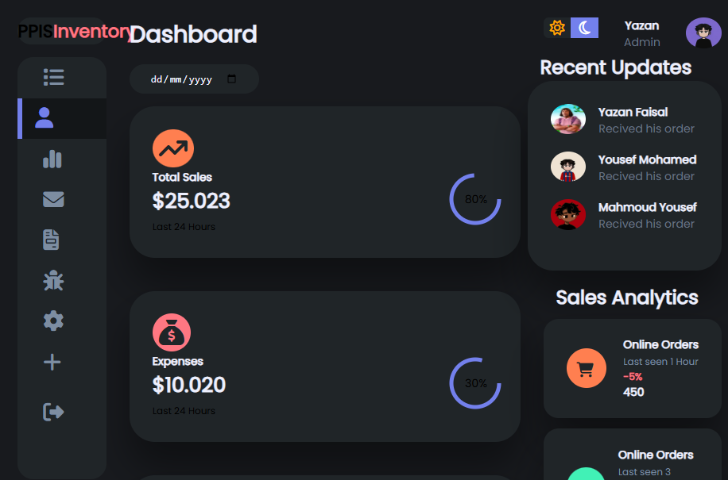
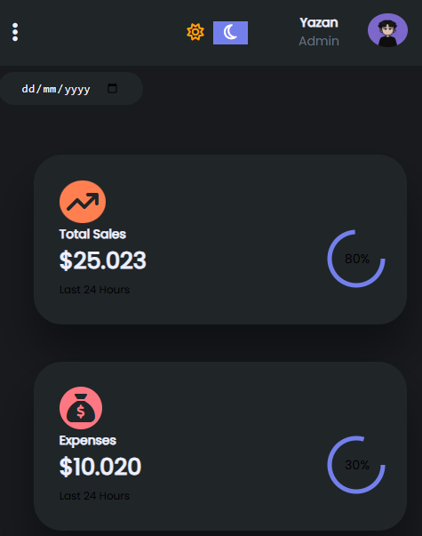
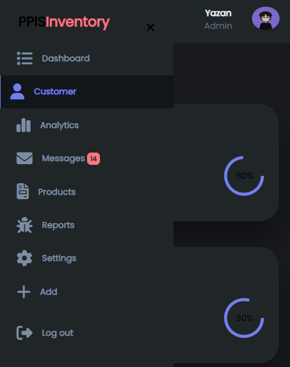

# Dashboard Project




## 📌 Overview
This is a dynamic and interactive dashboard designed to visualize and analyze data effectively. The project is built using HTML, CSS and JS to ensure a smooth and responsive user experience.

## 📸 Screenshots

### 🔷 Dashboard Sidebar




### 🔷 Charts & Graphs



### 🔷 Recent Orders Section



### 🔷 Small Size View


### 🔷 Mobile View 




## 🛠️ Technologies Used
- **Frontend:** HTML, CSS, JavaScript 

## 🚀 Installation & Setup
1. Clone the repository:
   ```bash
   git clone https://github.com/YazanFAlagan/Dashboard.git
   ```
2. Navigate to the project directory:
   ```bash
   cd Dashboard
   ```
3. Install dependencies:
   ```bash
   npm install  # or yarn install
   ```
4. Start the development server:
   ```bash
   npm start  # or yarn start
   ```
5. Open your browser and visit `https://yazanfalagan.github.io/Dashboard/`


## 📢 Contributing
Feel free to fork this repository and submit pull requests for improvements or bug fixes. Contributions are always welcome!

## 📄 License
This project is licensed under the [MIT License](LICENSE).

## 📧 Contact
For any inquiries or suggestions, reach out to me:
- **Email:** yazanfalagan@gmail.com
- **LinkedIn:** [Yazan Alagan]([https://www.linkedin.com/in/yazan-alagan](https://www.linkedin.com/in/yazan-alagan-981a63266/))
- **GitHub:** [YazanFAlagan](https://github.com/YazanFAlagan)
